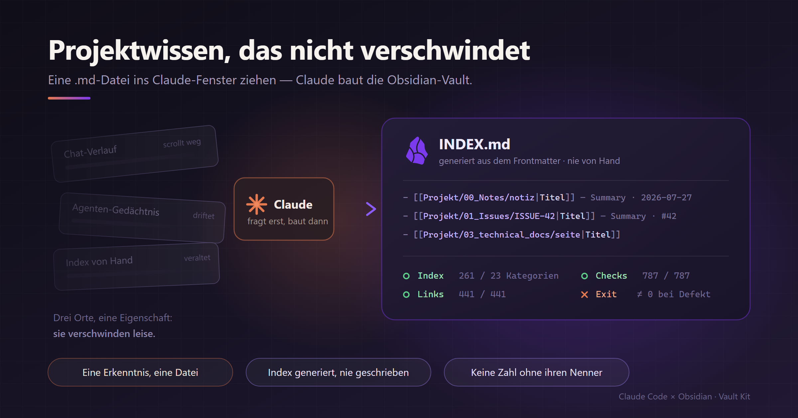

# Claude × Obsidian — Vault Kit

A setup contract for Claude that builds you a project-knowledge vault in Obsidian: predictable
structure, a **generated** index, and a set of guards that go red instead of quietly passing.

## Use it

1. Download [`claude-obsidian-vault-kit.md`](claude-obsidian-vault-kit.md).
2. Drop it into a Claude conversation.
3. Say **"set this up for me"**.

Claude interviews you first — do you already use Obsidian, install it or will you, do you want a
throwaway test vault to rearrange before it becomes real, which projects, which repos, which backup,
which shell — and only then writes anything to disk.

The file contains no vault content and no personal data. Structure, contracts, and rules only.

## What you end up with

- One folder per project, identical every time, so a path is predictable without looking.
- A three-level index — vault → project → category — **generated from note frontmatter only**. The
  generator has no access to note bodies, which is what structurally prevents prose from leaking into
  the index.
- Guard scripts that each refuse a silent zero: link resolution, duplicate detection, freshness of
  scheduled jobs, and a test runner that will not report green over zero collected suites.
- Optionally, a one-way mirror of a GitHub issue tracker into the vault: write via `gh`, read locally.
- A workflow document in your own words, so the next session reads it instead of re-deriving
  everything.

## The part that actually matters

The folder names are cosmetic. These are not:

- **One insight, one file.** If a note's title needs the word "and", it is two notes.
- **The index is generated, never written.** Not an optimisation — a structural guarantee.
- **A degraded result makes the run red.** Missing `title:`, a wikilink pointing nowhere: reported,
  with a non-zero exit code. Silent repair means the note stays broken and nobody finds out.
- **No number without its denominator.** "0 broken links" is meaningless if the checker scanned zero
  files. Every check reports `n of m` and distinguishes pass, fail, and *did not run*.
- **A number written into a versioned file carries the command that reproduces it.** Otherwise it
  goes stale and gets quoted anyway.

Section 10 of the kit is an **acceptance test**: Claude has to feed each guard deliberately broken
input on your machine and show that it goes red. Clean input proves nothing, so the setup is not
reported as finished until that passes.

## Requirements

- Claude with file access to the folder you want the vault in
- Obsidian ([obsidian.md](https://obsidian.md)) — the kit offers to install it if you have not
- Python 3.10+ for the guard scripts
- Optional: `git` for history, a cloud-synced folder for backup, `gh` for the issue mirror

## Maintainer notes

**Not verified on macOS or Linux.** The kit emits per-shell commands and the `brew` / `flatpak` /
`python3` paths are plausible but have only ever been exercised on Windows with PowerShell and Git
Bash. Reports from other platforms are the most useful thing you can open an issue about.

**Before publishing a change, cold-run it.** A throwaway folder, a *fresh* Claude session with none
of the authoring context, the file dropped in, and naive answers — "don't know", "I don't understand
that question". That is the only test that finds wording which is only clear to whoever wrote it.

## License

MIT — see [LICENSE](LICENSE).

Obsidian and Claude are trademarks of their respective owners. This kit is an independent, unofficial
template and implies no endorsement by either.
